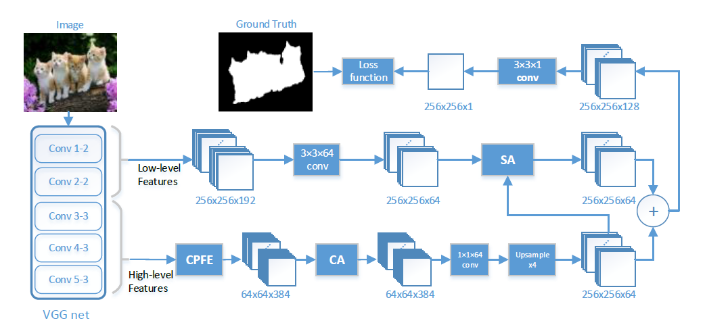
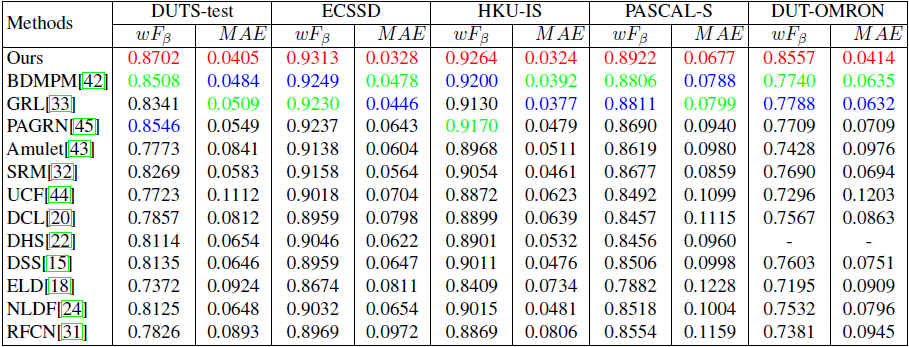

# cvpr2019_Pyramid-Feature-Attention-Network-for-Saliency-detection

Source code for our CVPR 2019 paper "Pyramid Feature Attention Network for Saliency detection" by Ting Zhao and Xiangqian Wu. ([ArXiv paper link](https://arxiv.org/abs/1903.00179))



## Download Saliency Maps

We provide our saliency maps of benchmark datasets used in the paper for convenience. 

Google: [link](https://drive.google.com/file/d/1s70Cb6_Z6cZqwiHgUw1ps19N00LC_HCz/view?usp=sharing)          

Baidu: [link](https://pan.baidu.com/s/1TljFZb3pFkl3IRoCYZFe4Q)  extraction：9yt5


## Setup
Install dependencies:
```
  Tensorflow (-gpu)
  Keras
  numpy
  opencv-python
  matplotlib
```
## Usage:
```
  train:
  python train.py --train_file=train_pair.txt --model_weights=model/vgg16_no_top.h5
  test:
  jupyter notebook
  run dome.ipynb
```

## Result




## If you think this work is helpful, please cite
```
@inproceedings{zhao2019pyramid,
    title = {Pyramid Feature Attention Network for Saliency detection},
    author={Ting Zhao and Xiangqian Wu},
    booktitle = {IEEE Conference on Computer Vision and Pattern Recognition (CVPR)},
    year = {2019}
}
```
